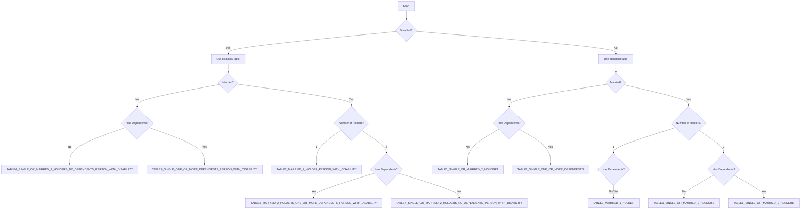

# Tax Situations

Portuguese dependent worker taxation is based on specific "situations" that determine which tax table applies to a person's income. Understanding these situations is crucial for accurate tax calculations.

## Overview

The library automatically determines the appropriate tax situation based on:
- **Marital status** (single/married)
- **Number of income holders** (1 or 2 for married couples)
- **Dependents** (children or other dependents)
- **Disability status** (worker or spouse)

> These situations apply to the **dependent worker** simulator. Independent worker calculations follow the simplified regime tables instead of retention situations.

## Tax Situation Codes

### TABLE1_SINGLE_OR_MARRIED_2_HOLDERS - Single or Married with Two Holders

**Code**: `TABLE1_SINGLE_OR_MARRIED_2_HOLDERS`  
**Description**: Single without dependents OR married with two income holders

**Applies to**:
- Single person without dependents
- Married couple with 2 income holders, with or without dependents

<RunCode defaultCode={`// Single person, no dependents
const single = simulateDependentWorker({
  income: 1200,
  married: false,
  numberOfDependents: 0
});

// Married, both working, no dependents
const marriedTwoHolders = simulateDependentWorker({
  income: 1500,
  married: true,
  numberOfHolders: 2,
  numberOfDependents: 0
});

// Married, both working, with children
const marriedWithKids = simulateDependentWorker({
  income: 1800,
  married: true,
  numberOfHolders: 2,
  numberOfDependents: 2
});

console.log('=== TABLE1 Examples ===');
console.log(\`Single - Net: €\${single.netSalary.toFixed(2)}\`);
console.log(\`Married 2 holders - Net: €\${marriedTwoHolders.netSalary.toFixed(2)}\`);
console.log(\`Married with kids - Net: €\${marriedWithKids.netSalary.toFixed(2)}\`);`} />

### TABLE2_SINGLE_ONE_OR_MORE_DEPENDENTS - Single with Dependents

**Code**: `TABLE2_SINGLE_ONE_OR_MORE_DEPENDENTS`  
**Description**: Single person with one or more dependents

**Applies to**:
- Single parent with children
- Single person caring for dependents

<RunCode defaultCode={`// Single parent with 2 children
const singleParent = simulateDependentWorker({
  income: 1400,
  married: false,
  numberOfDependents: 2
});

console.log('=== TABLE2 Example ===');
console.log(\`Single Parent - Net: €\${singleParent.netSalary.toFixed(2)}\`);
console.log(\`Tax Benefits: €\${singleParent.bracket.deduction.toFixed(2)}\`);`} />

### TABLE3_MARRIED_1_HOLDER - Married, Single Holder

**Code**: `TABLE3_MARRIED_1_HOLDER`  
**Description**: Married with only one income holder

**Applies to**:
- Married couple where only one person works
- Can be with or without dependents

<RunCode defaultCode={`// Married, single income, no children
const marriedSingleIncome = simulateDependentWorker({
  income: 2000,
  married: true,
  numberOfHolders: 1,
  numberOfDependents: 0
});

// Married, single income, with children
const marriedWithKids = simulateDependentWorker({
  income: 2200,
  married: true,
  numberOfHolders: 1,
  numberOfDependents: 3
});

console.log('=== TABLE3 Examples ===');
console.log(\`Married Single Income - Net: €\${marriedSingleIncome.netSalary.toFixed(2)}\`);
console.log(\`Married with Kids - Net: €\${marriedWithKids.netSalary.toFixed(2)}\`);`} />

## Disability Situations

All base situations have corresponding disability variants with lower tax rates:

### TABLE4_SINGLE_OR_MARRIED_2_HOLDERS_NO_DEPENDENTS_PERSON_WITH_DISABILITY - Single/Two Holders with Disability

**Code**: `TABLE4_SINGLE_OR_MARRIED_2_HOLDERS_NO_DEPENDENTS_PERSON_WITH_DISABILITY`  
**Description**: Same as TABLE1 but with disability benefits

<RunCode defaultCode={`// Single person with disability
const singleDisabled = simulateDependentWorker({
  income: 1200,
  married: false,
  disabled: true
});

// Married, both working, one with disability
const marriedDisabled = simulateDependentWorker({
  income: 1500,
  married: true,
  numberOfHolders: 2,
  disabled: true
});

console.log('=== TABLE4 Examples ===');
console.log(\`Single Disabled - Net: €\${singleDisabled.netSalary.toFixed(2)}\`);
console.log(\`Married Disabled - Net: €\${marriedDisabled.netSalary.toFixed(2)}\`);`} />

### TABLE5_SINGLE_ONE_OR_MORE_DEPENDENTS_PERSON_WITH_DISABILITY - Single with Dependents and Disability

**Code**: `TABLE5_SINGLE_ONE_OR_MORE_DEPENDENTS_PERSON_WITH_DISABILITY`  
**Description**: Single with dependents and disability

<RunCode defaultCode={`// Single parent with disability and children
const singleParentDisabled = simulateDependentWorker({
  income: 1400,
  married: false,
  disabled: true,
  numberOfDependents: 2
});

console.log('=== TABLE5 Example ===');
console.log(\`Single Parent Disabled - Net: €\${singleParentDisabled.netSalary.toFixed(2)}\`);`} />

### TABLE6_MARRIED_2_HOLDERS_ONE_OR_MORE_DEPENDENTS_PERSON_WITH_DISABILITY - Married Two Holders with Dependents and Disability

**Code**: `TABLE6_MARRIED_2_HOLDERS_ONE_OR_MORE_DEPENDENTS_PERSON_WITH_DISABILITY`  
**Description**: Married with two holders, dependents, and disability

<RunCode defaultCode={`// Married, both working, children, one with disability
const marriedTwoHoldersDisabled = simulateDependentWorker({
  income: 1800,
  married: true,
  numberOfHolders: 2,
  numberOfDependents: 2,
  disabled: true
});

console.log('=== TABLE6 Example ===');
console.log(\`Married Two Holders Disabled - Net: €\${marriedTwoHoldersDisabled.netSalary.toFixed(2)}\`);`} />

### TABLE7_MARRIED_1_HOLDER_PERSON_WITH_DISABILITY - Married Single Holder with Disability

**Code**: `TABLE7_MARRIED_1_HOLDER_PERSON_WITH_DISABILITY`  
**Description**: Married single holder with disability

<RunCode defaultCode={`// Married, single income, with disability
const marriedSingleIncomeDisabled = simulateDependentWorker({
  income: 2000,
  married: true,
  numberOfHolders: 1,
  disabled: true
});

console.log('=== TABLE7 Example ===');
console.log(\`Married Single Income Disabled - Net: €\${marriedSingleIncomeDisabled.netSalary.toFixed(2)}\`);`} />

## Situation Determination Logic

The library uses the following logic to determine the tax situation:

## Partner Disability Benefits

If your spouse has a disability (but you don't), you may qualify for additional deductions:

<RunCode defaultCode={`// Partner has disability
const partnerDisabled = simulateDependentWorker({
  income: 1600,
  married: true,
  numberOfHolders: 1,
  partnerDisabled: true // Additional deductions apply
});

console.log('=== Partner Disability Benefits ===');
console.log(\`Net Salary: €\${partnerDisabled.netSalary.toFixed(2)}\`);
console.log(\`Additional Deduction: €\${partnerDisabled.bracket.var2_deduction.toFixed(2)}\`);`} />

## Dependent Disability Benefits

Dependents with disabilities provide additional tax deductions:

<RunCode defaultCode={`// Family with disabled dependents
const familyWithDisabledDependent = simulateDependentWorker({
  income: 2000,
  married: true,
  numberOfHolders: 1,
  numberOfDependents: 3,
  numberOfDependentsDisabled: 1 // Extra deduction for disabled dependent
});

console.log('=== Dependent Disability Benefits ===');
console.log(\`Net Salary: €\${familyWithDisabledDependent.netSalary.toFixed(2)}\`);
console.log(\`Dependent Deduction: €\${familyWithDisabledDependent.bracket.dependent_aditional_deduction.toFixed(2)}\`);`} />

## Important Notes

### Number of Holders Rules

- **Single**: `numberOfHolders` must be `null`
- **Married**: `numberOfHolders` must be `1` or `2`
- Cannot specify 2 holders without being married

### Dependent Rules

- `numberOfDependentsDisabled` cannot exceed `numberOfDependents`
- Dependents include children and other qualifying family members
- Number of dependents affects tax brackets and deductions

### Validation

The library automatically validates your input and will throw descriptive errors for invalid combinations:

<RunCode defaultCode={`// This will throw an error
try {
  simulateDependentWorker({
    income: 1500,
    married: false,
    numberOfHolders: 2 // Invalid: single person cannot have 2 holders
  });
} catch (error) {
  console.error('Error:', error.message);
}

// This will also throw an error
try {
  simulateDependentWorker({
    income: 1500,
    numberOfDependents: 2,
    numberOfDependentsDisabled: 3 // Invalid: more disabled than total dependents
  });
} catch (error) {
  console.error('Error:', error.message);
}`} />

## Tax Benefits Summary

Different situations provide different levels of tax benefits:

| Situation | Tax Level | Benefits |
|-----------|-----------|----------|
| TABLE1_SINGLE_OR_MARRIED_2_HOLDERS | Standard | Base tax rates |
| TABLE2_SINGLE_ONE_OR_MORE_DEPENDENTS | Lower | Single parent benefits |
| TABLE3_MARRIED_1_HOLDER | Lower | Single income household benefits |
| TABLE4-7 (Disability variants) | Lowest | Disability tax reductions |

Understanding your tax situation helps ensure you're using the correct calculation parameters and receiving all applicable benefits. 
