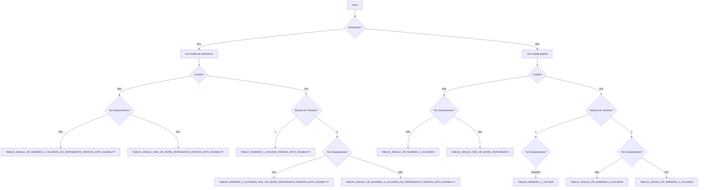

# Situações Fiscais

A tributação de trabalhadores por conta de outrem em Portugal baseia-se em "situações" específicas que determinam qual tabela fiscal se aplica ao rendimento de uma pessoa. Compreender estas situações é crucial para cálculos fiscais precisos.

## Visão Geral

A biblioteca determina automaticamente a situação fiscal apropriada com base em:
- **Estado civil** (solteiro/casado)
- **Número de titulares de rendimentos** (1 ou 2 para casais)
- **Dependentes** (filhos ou outros dependentes)
- **Estado de deficiência** (trabalhador ou cônjuge)

> Estas situações aplicam-se ao simulador de **trabalhador por conta de outrem**. Os cálculos de trabalhador independente seguem as tabelas do regime simplificado em vez de situações de retenção.

## Códigos de Situação Fiscal

### TABLE1_SINGLE_OR_MARRIED_2_HOLDERS - Solteiro ou Casado com Dois Titulares

**Código**: `TABLE1_SINGLE_OR_MARRIED_2_HOLDERS`  
**Descrição**: Solteiro sem dependentes OU casado com dois titulares de rendimentos

**Aplica-se a**:
- Pessoa solteira sem dependentes
- Casal casado com 2 titulares de rendimentos, com ou sem dependentes

<RunCode defaultCode={`// Pessoa solteira, sem dependentes
const single = simulateDependentWorker({
  year: 2025,
  income: 1200,
  married: false,
  numberOfDependents: 0
});

// Casado, ambos a trabalhar, sem dependentes
const marriedTwoHolders = simulateDependentWorker({
  year: 2025,
  income: 1500,
  married: true,
  numberOfHolders: 2,
  numberOfDependents: 0
});

// Casado, ambos a trabalhar, com filhos
const marriedWithKids = simulateDependentWorker({
  year: 2025,
  income: 1800,
  married: true,
  numberOfHolders: 2,
  numberOfDependents: 2
});

console.log('=== Exemplos TABLE1 (Janeiro) ===');
console.log(\`Solteiro - Líquido: €\${single.monthlyBreakdown[0].netIncome.totalAmount.toFixed(2)}\`);
console.log(\`Casado 2 titulares - Líquido: €\${marriedTwoHolders.monthlyBreakdown[0].netIncome.totalAmount.toFixed(2)}\`);
console.log(\`Casado com filhos - Líquido: €\${marriedWithKids.monthlyBreakdown[0].netIncome.totalAmount.toFixed(2)}\`);`} />

### TABLE2_SINGLE_ONE_OR_MORE_DEPENDENTS - Solteiro com Dependentes

**Código**: `TABLE2_SINGLE_ONE_OR_MORE_DEPENDENTS`  
**Descrição**: Pessoa solteira com um ou mais dependentes

**Aplica-se a**:
- Pai/mãe solteiro(a) com filhos
- Pessoa solteira a cuidar de dependentes

<RunCode defaultCode={`// Pai/mãe solteiro(a) com 2 filhos
const singleParent = simulateDependentWorker({
  year: 2025,
  income: 1400,
  married: false,
  numberOfDependents: 2
});

const jan = singleParent.monthlyBreakdown[0];
console.log('=== Exemplo TABLE2 ===');
console.log(\`Pai/Mãe Solteiro(a) - Líquido: €\${jan.netIncome.totalAmount.toFixed(2)}\`);
console.log(\`Benefícios Fiscais: €\${jan.bracket.deduction.toFixed(2)}\`);`} />

### TABLE3_MARRIED_1_HOLDER - Casado, Um Titular

**Código**: `TABLE3_MARRIED_1_HOLDER`  
**Descrição**: Casado com apenas um titular de rendimentos

**Aplica-se a**:
- Casal casado onde apenas uma pessoa trabalha
- Pode ser com ou sem dependentes

<RunCode defaultCode={`// Casado, rendimento único, sem filhos
const marriedSingleIncome = simulateDependentWorker({
  year: 2025,
  income: 2000,
  married: true,
  numberOfHolders: 1,
  numberOfDependents: 0
});

// Casado, rendimento único, com filhos
const marriedWithKids = simulateDependentWorker({
  year: 2025,
  income: 2200,
  married: true,
  numberOfHolders: 1,
  numberOfDependents: 3
});

console.log('=== Exemplos TABLE3 (Janeiro) ===');
console.log(\`Casado Rendimento Único - Líquido: €\${marriedSingleIncome.monthlyBreakdown[0].netIncome.totalAmount.toFixed(2)}\`);
console.log(\`Casado com Filhos - Líquido: €\${marriedWithKids.monthlyBreakdown[0].netIncome.totalAmount.toFixed(2)}\`);`} />

## Situações de Deficiência

Todas as situações base têm variantes de deficiência correspondentes com taxas fiscais mais baixas:

### TABLE4_SINGLE_OR_MARRIED_2_HOLDERS_NO_DEPENDENTS_PERSON_WITH_DISABILITY - Solteiro/Dois Titulares com Deficiência

**Código**: `TABLE4_SINGLE_OR_MARRIED_2_HOLDERS_NO_DEPENDENTS_PERSON_WITH_DISABILITY`  
**Descrição**: Igual à TABLE1 mas com benefícios de deficiência

<RunCode defaultCode={`// Pessoa solteira com deficiência
const singleDisabled = simulateDependentWorker({
  year: 2025,
  income: 1200,
  married: false,
  disabled: true
});

// Casado, ambos a trabalhar, um com deficiência
const marriedDisabled = simulateDependentWorker({
  year: 2025,
  income: 1500,
  married: true,
  numberOfHolders: 2,
  disabled: true
});

console.log('=== Exemplos TABLE4 (Janeiro) ===');
console.log(\`Solteiro com Deficiência - Líquido: €\${singleDisabled.monthlyBreakdown[0].netIncome.totalAmount.toFixed(2)}\`);
console.log(\`Casado com Deficiência - Líquido: €\${marriedDisabled.monthlyBreakdown[0].netIncome.totalAmount.toFixed(2)}\`);`} />

### TABLE5_SINGLE_ONE_OR_MORE_DEPENDENTS_PERSON_WITH_DISABILITY - Solteiro com Dependentes e Deficiência

**Código**: `TABLE5_SINGLE_ONE_OR_MORE_DEPENDENTS_PERSON_WITH_DISABILITY`  
**Descrição**: Solteiro com dependentes e deficiência

<RunCode defaultCode={`// Pai/mãe solteiro(a) com deficiência e filhos
const singleParentDisabled = simulateDependentWorker({
  year: 2025,
  income: 1400,
  married: false,
  disabled: true,
  numberOfDependents: 2
});

console.log('=== Exemplo TABLE5 ===');
console.log(\`Pai/Mãe Solteiro(a) com Deficiência - Líquido: €\${singleParentDisabled.monthlyBreakdown[0].netIncome.totalAmount.toFixed(2)}\`);`} />

### TABLE6_MARRIED_2_HOLDERS_ONE_OR_MORE_DEPENDENTS_PERSON_WITH_DISABILITY - Casado Dois Titulares com Dependentes e Deficiência

**Código**: `TABLE6_MARRIED_2_HOLDERS_ONE_OR_MORE_DEPENDENTS_PERSON_WITH_DISABILITY`  
**Descrição**: Casado com dois titulares, dependentes e deficiência

<RunCode defaultCode={`// Casado, ambos a trabalhar, filhos, um com deficiência
const marriedTwoHoldersDisabled = simulateDependentWorker({
  year: 2025,
  income: 1800,
  married: true,
  numberOfHolders: 2,
  numberOfDependents: 2,
  disabled: true
});

console.log('=== Exemplo TABLE6 ===');
console.log(\`Casado Dois Titulares com Deficiência - Líquido: €\${marriedTwoHoldersDisabled.monthlyBreakdown[0].netIncome.totalAmount.toFixed(2)}\`);`} />

### TABLE7_MARRIED_1_HOLDER_PERSON_WITH_DISABILITY - Casado Um Titular com Deficiência

**Código**: `TABLE7_MARRIED_1_HOLDER_PERSON_WITH_DISABILITY`  
**Descrição**: Casado um titular com deficiência

<RunCode defaultCode={`// Casado, rendimento único, com deficiência
const marriedSingleIncomeDisabled = simulateDependentWorker({
  year: 2025,
  income: 2000,
  married: true,
  numberOfHolders: 1,
  disabled: true
});

console.log('=== Exemplo TABLE7 ===');
console.log(\`Casado Rendimento Único com Deficiência - Líquido: €\${marriedSingleIncomeDisabled.monthlyBreakdown[0].netIncome.totalAmount.toFixed(2)}\`);`} />

## Lógica de Determinação de Situação

A biblioteca usa a seguinte lógica para determinar a situação fiscal:

## Benefícios de Deficiência do Cônjuge

Se o seu cônjuge tem deficiência (mas você não), pode qualificar-se para deduções adicionais:

<RunCode defaultCode={`// Cônjuge tem deficiência
const partnerDisabled = simulateDependentWorker({
  year: 2025,
  income: 1600,
  married: true,
  numberOfHolders: 1,
  partnerDisabled: true // Deduções adicionais aplicam-se
});

const jan = partnerDisabled.monthlyBreakdown[0];
console.log('=== Benefícios de Deficiência do Cônjuge ===');
console.log(\`Salário Líquido: €\${jan.netIncome.totalAmount.toFixed(2)}\`);
console.log(\`Dedução Adicional: €\${jan.bracket.var2_deduction.toFixed(2)}\`);`} />

## Benefícios de Deficiência de Dependentes

Dependentes com deficiências fornecem deduções fiscais adicionais:

<RunCode defaultCode={`// Família com dependentes com deficiência
const familyWithDisabledDependent = simulateDependentWorker({
  year: 2025,
  income: 2000,
  married: true,
  numberOfHolders: 1,
  numberOfDependents: 3,
  numberOfDependentsDisabled: 1 // Dedução extra para dependente com deficiência
});

const jan = familyWithDisabledDependent.monthlyBreakdown[0];
console.log('=== Benefícios de Deficiência de Dependentes ===');
console.log(\`Salário Líquido: €\${jan.netIncome.totalAmount.toFixed(2)}\`);
console.log(\`Dedução de Dependente: €\${jan.bracket.dependent_aditional_deduction.toFixed(2)}\`);`} />

## Notas Importantes

### Regras de Número de Titulares

- **Solteiro**: `numberOfHolders` deve ser `null`
- **Casado**: `numberOfHolders` deve ser `1` ou `2`
- Não pode especificar 2 titulares sem ser casado

### Regras de Dependentes

- `numberOfDependentsDisabled` não pode exceder `numberOfDependents`
- Dependentes incluem filhos e outros membros da família qualificados
- O número de dependentes afeta os escalões fiscais e deduções

### Validação

A biblioteca valida automaticamente a sua entrada e lançará erros descritivos para combinações inválidas:

<RunCode defaultCode={`// Isto lançará um erro
try {
  simulateDependentWorker({
    year: 2025,
    income: 1500,
    married: false,
    numberOfHolders: 2 // Inválido: pessoa solteira não pode ter 2 titulares
  });
} catch (error) {
  console.error('Erro:', error.message);
}

// Isto também lançará um erro
try {
  simulateDependentWorker({
    year: 2025,
    income: 1500,
    numberOfDependents: 2,
    numberOfDependentsDisabled: 3 // Inválido: mais deficientes do que total de dependentes
  });
} catch (error) {
  console.error('Erro:', error.message);
}`} />

## Resumo de Benefícios Fiscais

Diferentes situações fornecem diferentes níveis de benefícios fiscais:

| Situação | Nível Fiscal | Benefícios |
|-----------|-----------|----------|
| TABLE1_SINGLE_OR_MARRIED_2_HOLDERS | Padrão | Taxas fiscais base |
| TABLE2_SINGLE_ONE_OR_MORE_DEPENDENTS | Mais Baixo | Benefícios de pai/mãe solteiro(a) |
| TABLE3_MARRIED_1_HOLDER | Mais Baixo | Benefícios de agregado com rendimento único |
| TABLE4-7 (Variantes de deficiência) | Mais Baixo | Reduções fiscais por deficiência |

Compreender a sua situação fiscal ajuda a garantir que está a usar os parâmetros de cálculo corretos e a receber todos os benefícios aplicáveis.
