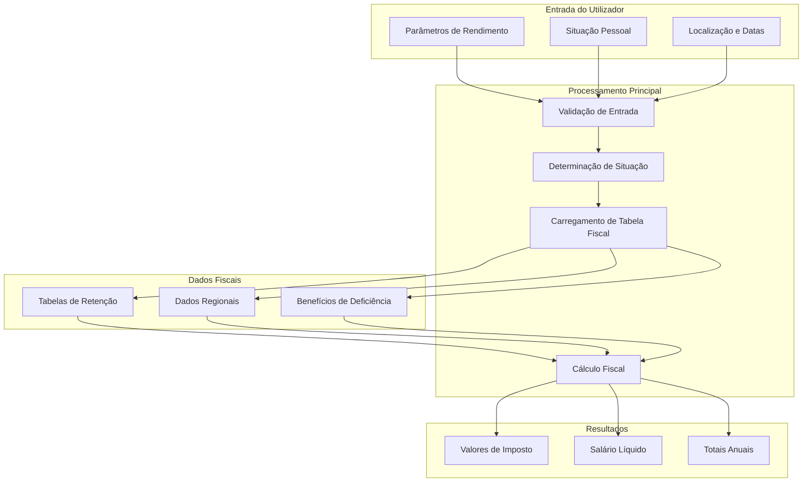
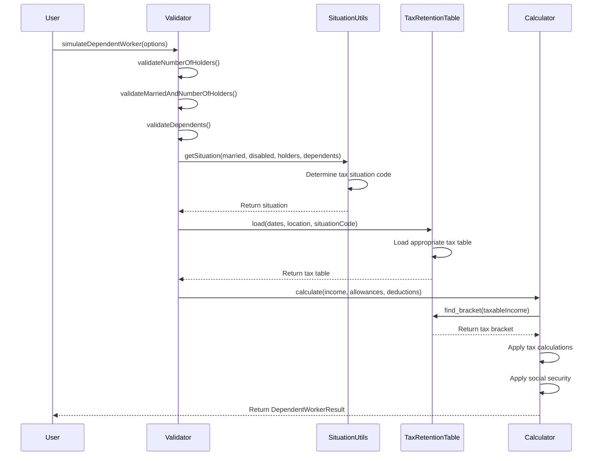
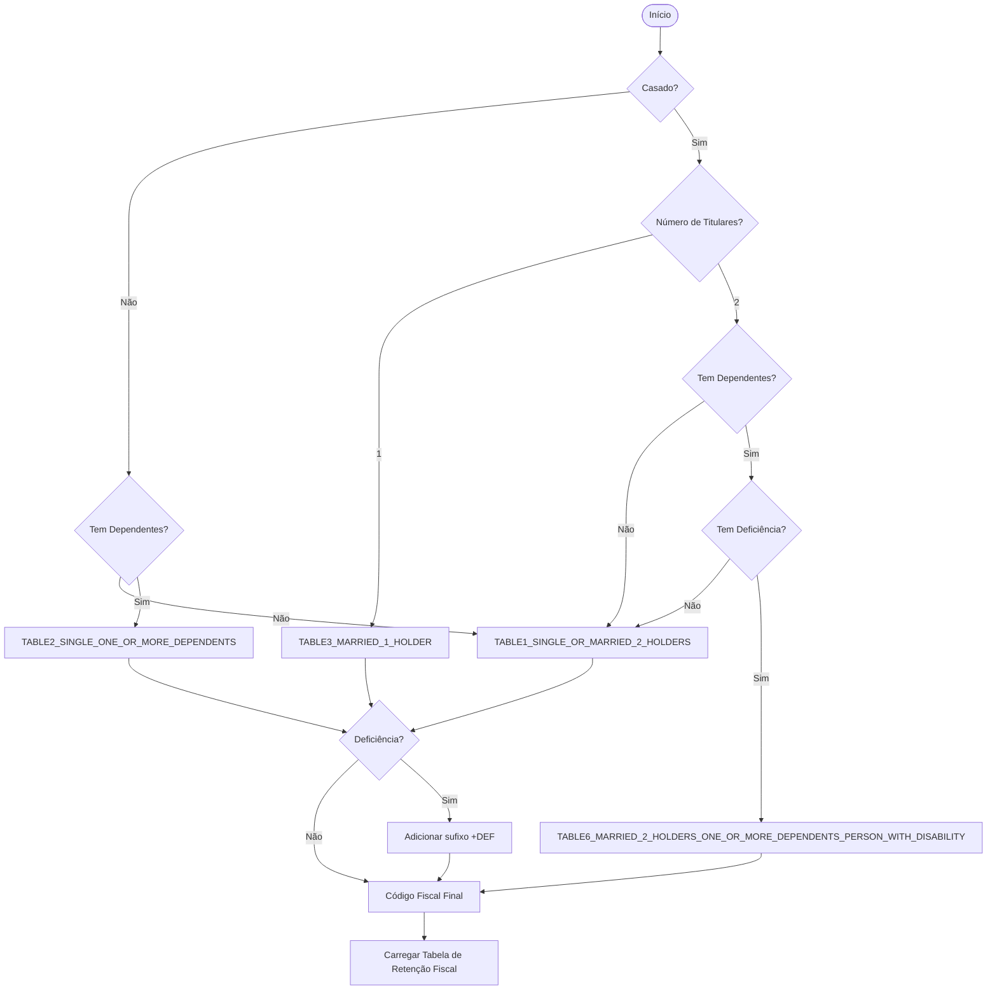
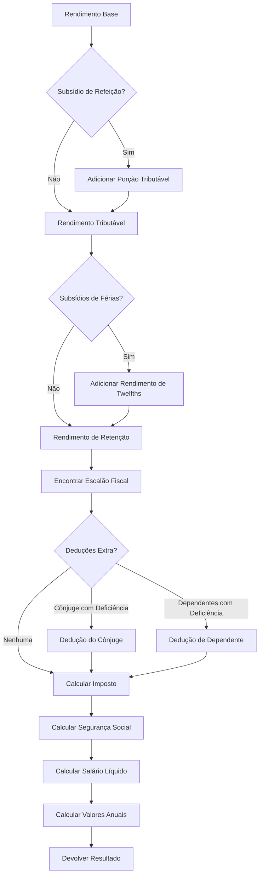
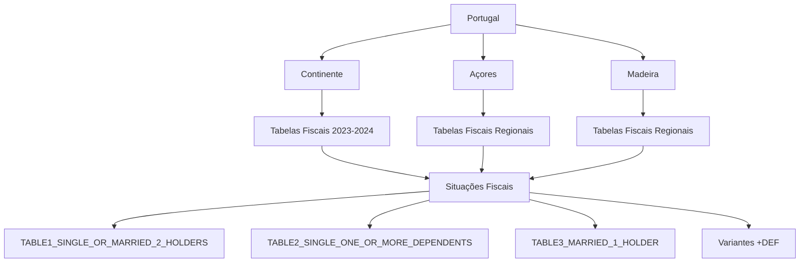

# Arquitetura

Arquitetura do sistema e fluxo de dados da biblioteca Saldo.

## Visão Geral do Sistema



## Processo de Fluxo de Dados



## Determinação de Situação Fiscal



## Arquitetura de Componentes

```mermaid
graph LR;
  subgraph API [API Pública]
    simulateDependentWorker[simulateDependentWorker];
  end
  
  subgraph Validation [Camada de Validação]
    validateNumberOfHolders;
    validateMarriedAndNumberOfHolders;
    validateDependents;
  end
  
  subgraph Core [Lógica Principal]
    SituationUtils;
    TaxRetentionTable;
    Calculations;
  end
  
  subgraph Data [Camada de Dados]
    TaxTables[Tabelas Fiscais JSON];
    Manifest[Manifesto de Tabelas];
  end
  
  subgraph Types [Sistema de Tipos]
    Schemas;
    Interfaces;
    Enums;
  end
  
  simulateDependentWorker --> Validation;
  Validation --> Core;
  Core --> Data;
  Types --> simulateDependentWorker;
  Types --> Core;
```



## Fluxo de Cálculo Fiscal



## Fluxo de Trabalhador Independente

```mermaid
flowchart TD
    A[Rendimento + Frequência] --> B[Validar entradas<br/>(dias de folga, ano fiscal, RNH)];
    B --> C[Rendimento Bruto<br/>(12 meses, 248 dias úteis)];
    C --> D[Segurança Social<br/>(base 70% × taxa × desconto,<br/>limitado a 12× IAS,<br/>primeiros 12 meses isentos)];
    C --> E[Deduções Específicas<br/>(máx €4104 vs 10% SS)];
    C --> F[Limite de Despesas<br/>(% regime simplificado maxExpensesTax)];
    F --> G[Despesas Necessárias];
    E --> H[Rendimento Tributável];
    D --> H;
    G --> H;
    H --> I[Desconto IRS de Juventude<br/>+ Fatores de Primeiro/Segundo Ano];
    I --> J[Cálculo IRS<br/>(escalões progressivos ou RNH fixo)];
    J --> K[Rendimento Líquido];
    D --> K;
```

## Estrutura de Dados Regionais



A arquitetura foi projetada para:
- **Modularidade**: Separação clara de responsabilidades
- **Extensibilidade**: Fácil adicionar novas regiões ou regras fiscais
- **Manutenibilidade**: Interfaces bem definidas e validação
- **Desempenho**: Carregamento eficiente de tabelas fiscais e cálculo
- **Segurança de Tipos**: Cobertura TypeScript completa para todas as operações
