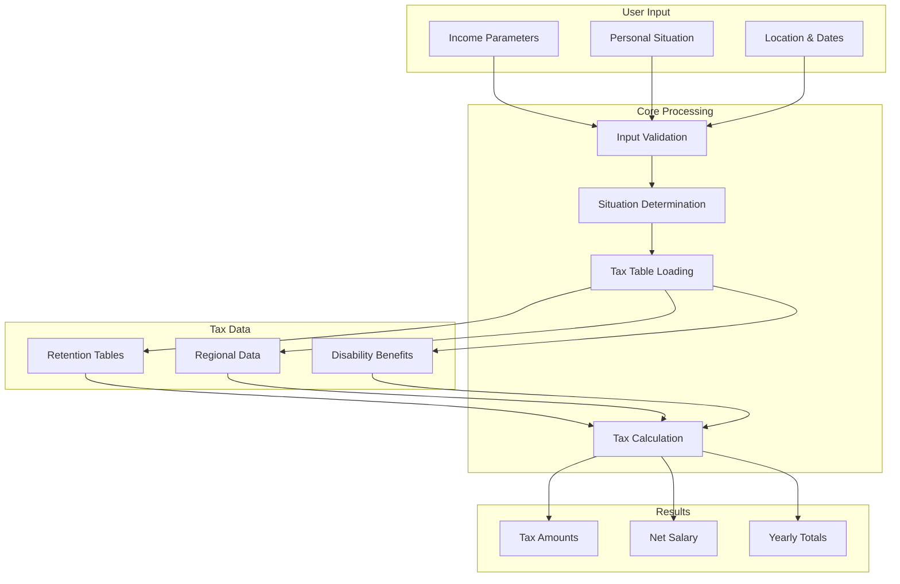
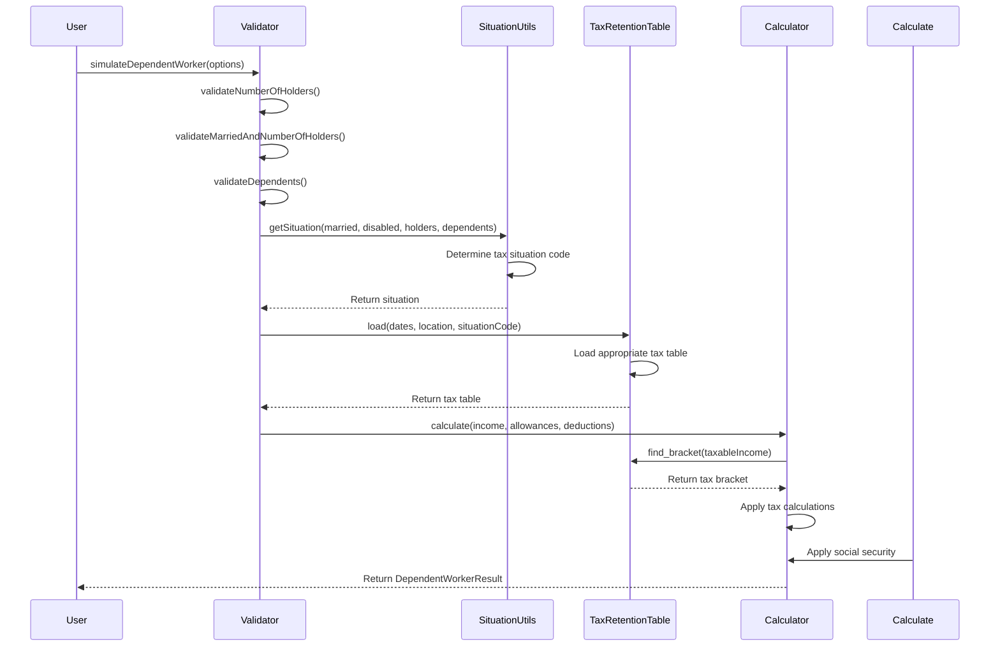
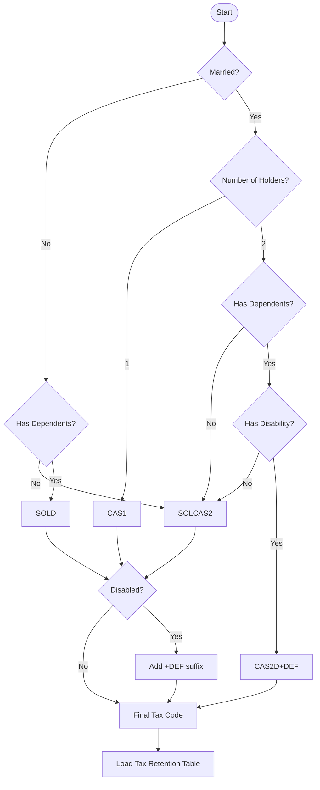
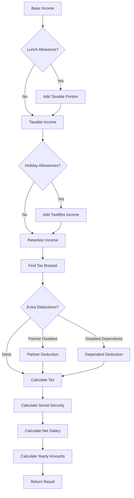
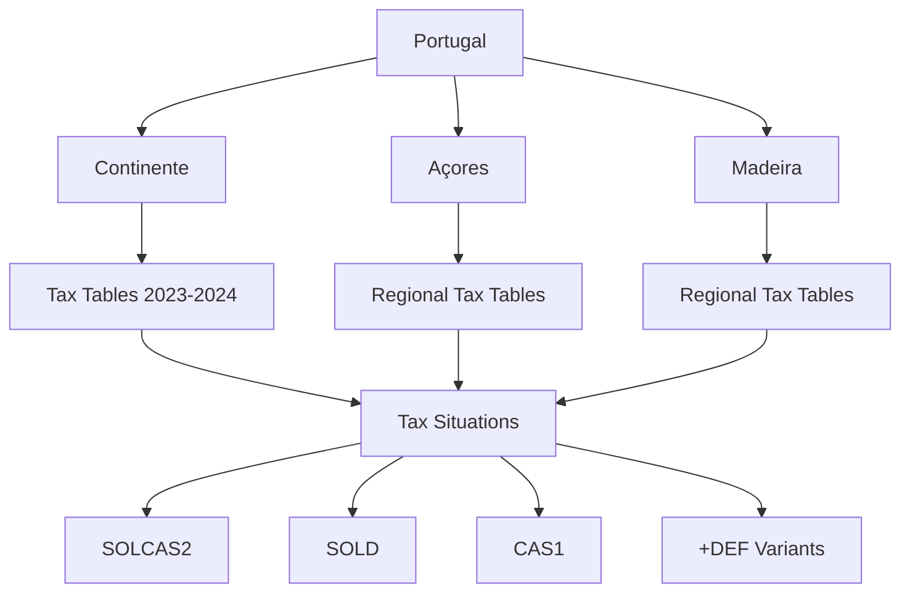

# Architecture

System architecture and data flow of the Saldo library.

## System Overview

## Data Flow Process

## Tax Situation Determination

## Component Architecture

```mermaid
graph LR;
  subgraph API [Public API]
    simulateDependentWorker[simulateDependentWorker];
  end
  
  subgraph Validation [Validation Layer]
    validateNumberOfHolders;
    validateMarriedAndNumberOfHolders;
    validateDependents;
  end
  
  subgraph Core [Core Logic]
    SituationUtils;
    TaxRetentionTable;
    Calculations;
  end
  
  subgraph Data [Data Layer]
    TaxTables[Tax Tables JSON];
    Manifest[Table Manifest];
  end
  
  subgraph Types [Type System]
    Schemas;
    Interfaces;
    Enums;
  end
  
  simulateDependentWorker --> Validation;
  Validation --> Core;
  Core --> Data;
  Types --> simulateDependentWorker;
  Types --> Core;
```

## Tax Calculation Flow

## Regional Data Structure

The architecture is designed for:
- **Modularity**: Clear separation of concerns
- **Extensibility**: Easy to add new regions or tax rules
- **Maintainability**: Well-defined interfaces and validation
- **Performance**: Efficient tax table loading and calculation
- **Type Safety**: Full TypeScript coverage for all operations
