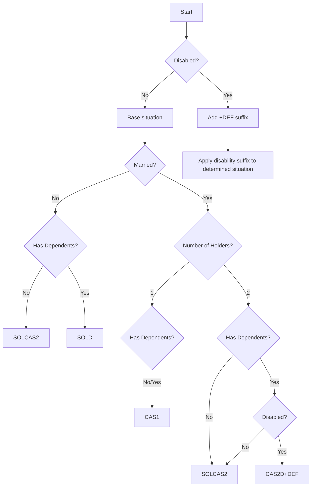

# Tax Situations

Portuguese dependent worker taxation is based on specific "situations" that determine which tax table applies to a person's income. Understanding these situations is crucial for accurate tax calculations.

## Overview

The library automatically determines the appropriate tax situation based on:
- **Marital status** (single/married)
- **Number of income holders** (1 or 2 for married couples)
- **Dependents** (children or other dependents)
- **Disability status** (worker or spouse)

## Tax Situation Codes

### SOLCAS2 - Single or Married with Two Holders

**Code**: `SOLCAS2`  
**Description**: Single without dependents OR married with two income holders

**Applies to**:
- Single person without dependents
- Married couple with 2 income holders, with or without dependents

```typescript
// Single person, no dependents
simulateDependentWorker({
  income: 1200,
  married: false,
  numberOfDependents: 0
});

// Married, both working, no dependents
simulateDependentWorker({
  income: 1500,
  married: true,
  numberOfHolders: 2,
  numberOfDependents: 0
});

// Married, both working, with children
simulateDependentWorker({
  income: 1800,
  married: true,
  numberOfHolders: 2,
  numberOfDependents: 2
});
```

### SOLD - Single with Dependents

**Code**: `SOLD`  
**Description**: Single person with one or more dependents

**Applies to**:
- Single parent with children
- Single person caring for dependents

```typescript
// Single parent with 2 children
simulateDependentWorker({
  income: 1400,
  married: false,
  numberOfDependents: 2
});
```

### CAS1 - Married, Single Holder

**Code**: `CAS1`  
**Description**: Married with only one income holder

**Applies to**:
- Married couple where only one person works
- Can be with or without dependents

```typescript
// Married, single income, no children
simulateDependentWorker({
  income: 2000,
  married: true,
  numberOfHolders: 1,
  numberOfDependents: 0
});

// Married, single income, with children
simulateDependentWorker({
  income: 2200,
  married: true,
  numberOfHolders: 1,
  numberOfDependents: 3
});
```

## Disability Situations

All base situations have corresponding disability variants with lower tax rates:

### SOLCAS2+DEF - Single/Two Holders with Disability

**Code**: `SOLCAS2+DEF`  
**Description**: Same as SOLCAS2 but with disability benefits

```typescript
// Single person with disability
simulateDependentWorker({
  income: 1200,
  married: false,
  disabled: true
});

// Married, both working, one with disability
simulateDependentWorker({
  income: 1500,
  married: true,
  numberOfHolders: 2,
  disabled: true
});
```

### SOLD+DEF - Single with Dependents and Disability

**Code**: `SOLD+DEF`  
**Description**: Single with dependents and disability

```typescript
// Single parent with disability and children
simulateDependentWorker({
  income: 1400,
  married: false,
  disabled: true,
  numberOfDependents: 2
});
```

### CAS1+DEF - Married Single Holder with Disability

**Code**: `CAS1+DEF`  
**Description**: Married single holder with disability

```typescript
// Married, single income, with disability
simulateDependentWorker({
  income: 2000,
  married: true,
  numberOfHolders: 1,
  disabled: true
});
```

### CAS2D+DEF - Married Two Holders with Dependents and Disability

**Code**: `CAS2D+DEF`  
**Description**: Married with two holders, dependents, and disability

```typescript
// Married, both working, children, one with disability
simulateDependentWorker({
  income: 1800,
  married: true,
  numberOfHolders: 2,
  numberOfDependents: 2,
  disabled: true
});
```

## Situation Determination Logic

The library uses the following logic to determine the tax situation:



## Partner Disability Benefits

If your spouse has a disability (but you don't), you may qualify for additional deductions:

```typescript
// Partner has disability
simulateDependentWorker({
  income: 1600,
  married: true,
  numberOfHolders: 1,
  partnerDisabled: true // Additional deductions apply
});
```

## Dependent Disability Benefits

Dependents with disabilities provide additional tax deductions:

```typescript
// Family with disabled dependents
simulateDependentWorker({
  income: 2000,
  married: true,
  numberOfHolders: 1,
  numberOfDependents: 3,
  numberOfDependentsDisabled: 1 // Extra deduction for disabled dependent
});
```

## Important Notes

### Number of Holders Rules

- **Single**: `numberOfHolders` must be `null`
- **Married**: `numberOfHolders` must be `1` or `2`
- Cannot specify 2 holders without being married

### Dependent Rules

- `numberOfDependentsDisabled` cannot exceed `numberOfDependents`
- Dependents include children and other qualifying family members
- Number of dependents affects tax brackets and deductions

### Validation

The library automatically validates your input and will throw descriptive errors for invalid combinations:

```typescript
// This will throw an error
simulateDependentWorker({
  income: 1500,
  married: false,
  numberOfHolders: 2 // Invalid: single person cannot have 2 holders
});

// This will also throw an error
simulateDependentWorker({
  income: 1500,
  numberOfDependents: 2,
  numberOfDependentsDisabled: 3 // Invalid: more disabled than total dependents
});
```

## Tax Benefits Summary

Different situations provide different levels of tax benefits:

| Situation | Tax Level | Benefits |
|-----------|-----------|----------|
| SOLCAS2 | Standard | Base tax rates |
| SOLD | Lower | Single parent benefits |
| CAS1 | Lower | Single income household benefits |
| +DEF variants | Lowest | Disability tax reductions |

Understanding your tax situation helps ensure you're using the correct calculation parameters and receiving all applicable benefits. 